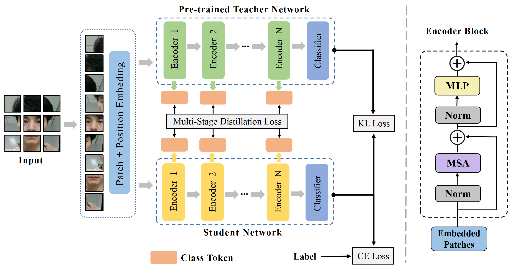

# KDFAS: Multi-stage Knowledge Distillation Vision Transformer for Face Anti-spoofing

Official repository for the paper "KDFAS: Multi-Stage Knowledge Distillation Vision Transformer for Face Anti-Spoofing", which has been accepted at PRCV 2023 and can be found [here](https://doi.org/10.1007/978-981-99-8469-5_13).

---

## 🔔Introduction
With the commercial application of face recognition systems, face anti-spoofing has been studied extensively to enhance security in recent years. In this work, a lightweight network via knowledge distillation for face anti-spoofing is proposed. The main innovations of our approach are threefold: 
(1) In convolutional neural network based knowledge distillation, the local receptive field of teacher network may be inconsistent with that of student network, which results in misguiding. In our method, vision transformer architecture is leveraged because of its global modeling capabilities. 
(2) Beyond conventional decision-level knowledge transfer in the classification step via kullback-leibler loss, we present multi-stage feature-level knowledge distillation strategy to guide the feature learning of student network which can transfer richer knowledge from teacher to student network.
(3) In contrast to traditional projection head learning, we construct a covariance matrix to solve the embedding dimensionality mismatching problem between teacher and student network in middle layers. 
Compared to teacher model of 1.28 GB, the memory of student model is only 330.8 MB, which effectively achieves a trade-off between memory and accuracy.

<div align="center">
    
</div>

## ✏️ Citation
If you find this work useful for your research, please feel free to leave a star⭐️ and cite our paper:

```bibtex
@InProceedings{KDFAS,
  author    = {Zhang, Jun and Zhang, Yunfei and Shao, Feixue and Ma, Xuetao and Zhou, Daoxiang},
  title     = {KDFAS: Multi-stage Knowledge Distillation Vision Transformer for Face Anti-spoofing},
  booktitle = {Pattern Recognition and Computer Vision},
  year      = {2024},
  pages     = {159--171},
  publisher = {Springer Nature Singapore},
}
```
