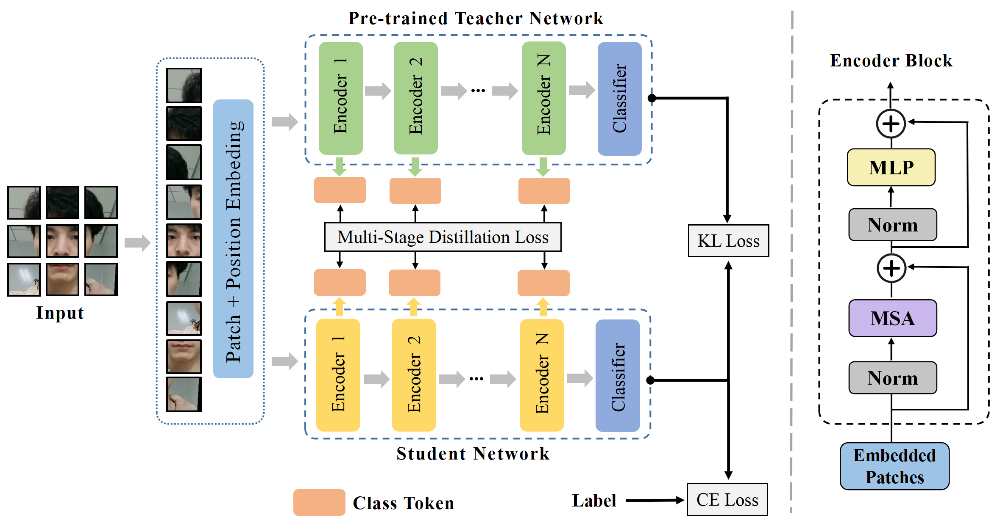

# KDFAS: Multi-stage Knowledge Distillation Vision Transformer for Face Anti-spoofing

---
This is the official repository for the paper "KDFAS: Multi-Stage Knowledge Distillation Vision Transformer for Face Anti-Spoofing", accepted at PRCV 2023. The paper can be found in [here](https://link.springer.com/chapter/10.1007/978-981-99-8469-5_13).

## Pipeline Overview


if you use KDFAS in this repository, please cite the following paper:
```
@InProceedings{KDFAS,
  author    = {Zhang, Jun and Zhang, Yunfei and Shao, Feixue and Ma, Xuetao and Zhou, Daoxiang},
  booktitle = {Pattern Recognition and Computer Vision},
  title     = {KDFAS: Multi-stage Knowledge Distillation Vision Transformer for Face Anti-spoofing},
  year      = {2024},
  pages     = {159--171},
  publisher = {Springer Nature Singapore},
}
```
